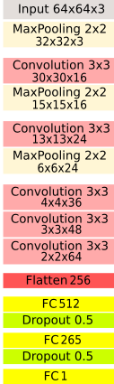
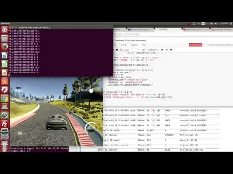
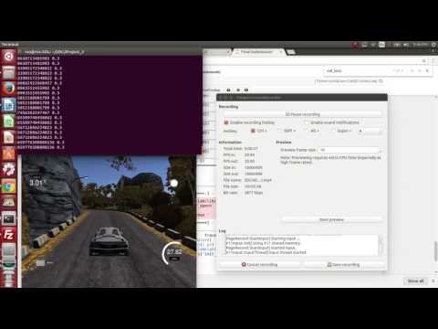
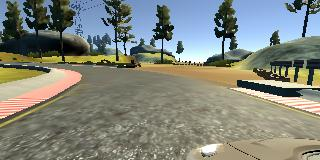
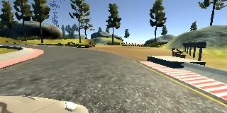

# Light-Weight Convolutional Network for Transfer Learning in Self-Driving Cars 

I present my approach for teaching a self-driving car how to drive using data collected from human-driving behavior. The solution includes image processing and deep learning techniques. I've developed a new convolutional network capable of generalizing to driving conditions in different terrains without apriori training on these roads. That was demonstrated by running the two simulators provided.  Using only three front cameras, the car is taught how to drive autonomously. This concept has been successfully demonstrated by Nvidia [1] and comma.ai[5]. 
The data sets were acquired by driving the a car in a simulator and collecting frames from the left, center, and right camera. Each frame is tagged with the location where it's stored. The steering angel as well as the car speed and brakes were also recorded. 

The project solution consists of two main parts: data processing and deep learning

In the data processing the images are parsed and then preprocessed for image augmentation. 
The python generators in keras were used to augment the images on the fly to solve the memory limitation problem.

The network architecture that I've developed was able to generalize and successfully drive the car and finish the first lap. It was also tested in the second track and sucsessfully drove the car without prior training through all the curves in the track except the last one, which was very sharp.

The CCN architecture consists of the the layers shown in the figure

The final results are shown in videos 1 and 2.

## How to run this code

The folder in this repository contains the following file

1- model.py, contains the methods and the model
2- drive.py, a socket to connect to the simulator and either collect training data or drive the car in autonomous mode
3- model_x.json and model_x.h5, the model architecture and weights
4- This read me document

For environment setup, you can see [the git hub starter kit](https://github.com/udacity/CarND-Term1-Starter-Kit). My setup included
Ubuntu 14.04
Anaconda
Python 3.5
Keras and TensorFlow for CPU
OpenCV3

I used amazon AWS for most of the computation on an Nvidia GPU grid. I have also created an Nvidia JetsonTx1 machine for testing my implementation on a robotic car. I will share my progress in a separate github repository. 

###To run the car in autonomous mode

First you need to download Udacity's [simulator](https://d17h27t6h515a5.cloudfront.net/topher/2016/November/5831f0f7_simulator-linux/simulator-linux.zip). Select the autonomous mode of any of the two tracks

In a separate shell, tun the command python 

drive.py model_4.json

###To collect a new datasets

Open the simulator and choose training mode. The collected data will be stored in an IMG directory and driving_log.csv sheet.Each row in this sheet correlates the captured images with the steering angle, throttle, brake, and speed of your car. The car has three cameras and each camera correlates the captured frames with the same steering angle.

Alternatively, you can use Udacity's [data sets](https://d17h27t6h515a5.cloudfront.net/topher/2016/December/584f6edd_data/data.zip) 

###Train the model
You can train the model from scratch by simply running model.py. The IMG and csv files must be in saved in the main directory where model.py is saved.

##  Image preprocessing and augmentation

The frames were captured from three cameras, this meant that a shift angle must be applied to the left and right frames. I've shifted the frames by 0.15 degrees after testing a range of angle between 0.8-0.30. 

  

Using the left and right images enabled the model to generalize very well and drive  the car in the second track without a prior training. However, adding those images made the car wiggly in the first track to the point where it touched the road sides. Therefore I came up with a strategy to include a 1/4 of the samples from those cameras. 

Each image was cropped from the bottom side to remove the car's hood. The sky and trees were left to help the model generalize well. 1/4 of the images were flipped and had their signed inverted to account for the lack of right turns problem.  

In the final pipeline the image brightness was changed randomly and then resized to 64x64. 

## CNN model

I've investigated Nvidia[1], Comma.ai[5], and VGG16 approaches but I wasn't able to get the desired driving behavior with the used datasets. Therefore I've developed a new model that successfully trained the car to drive on both tracks using Udacity's data only.  

The model starts by normalizing the images from keras's generators and then followed by a max pooling layer to seduce the size of the input image to 32x32. This approach was very helfull in capturing the important features in the image and reducing the data points and training time. 
Two dropout layers were added to the first fully connected layers to combat over fitting. 

For simplicity, the full architecture of the CNN is provided below

__________________________________________________________________________________________________
Layer (type)                     Output Shape          Param #     Connected to                     

====================================================================================================
lambda_4 (Lambda)                (None, 64, 64, 3)     0           lambda_input_4[0][0]             
____________________________________________________________________________________________________
maxpooling2d_9 (MaxPooling2D)    (None, 32, 32, 3)     0           lambda_4[0][0]                   
____________________________________________________________________________________________________
convolution2d_16 (Convolution2D) (None, 30, 30, 16)    448         maxpooling2d_9[0][0]             
____________________________________________________________________________________________________
maxpooling2d_10 (MaxPooling2D)   (None, 15, 15, 16)    0           convolution2d_16[0][0]           
____________________________________________________________________________________________________
convolution2d_17 (Convolution2D) (None, 13, 13, 24)    3480        maxpooling2d_10[0][0]            
____________________________________________________________________________________________________
maxpooling2d_11 (MaxPooling2D)   (None, 6, 6, 24)      0           convolution2d_17[0][0]           
____________________________________________________________________________________________________
convolution2d_18 (Convolution2D) (None, 4, 4, 36)      7812        maxpooling2d_11[0][0]            
____________________________________________________________________________________________________
convolution2d_19 (Convolution2D) (None, 3, 3, 48)      6960        convolution2d_18[0][0]           
____________________________________________________________________________________________________
convolution2d_20 (Convolution2D) (None, 2, 2, 64)      12352       convolution2d_19[0][0]           
____________________________________________________________________________________________________
flatten_4 (Flatten)              (None, 256)           0           convolution2d_20[0][0]           
____________________________________________________________________________________________________
dense_7 (Dense)                  (None, 512)           131584      flatten_4[0][0]                  
____________________________________________________________________________________________________
dropout_7 (Dropout)              (None, 512)           0           dense_7[0][0]                    
____________________________________________________________________________________________________
activation_7 (Activation)        (None, 512)           0           dropout_7[0][0]                  
____________________________________________________________________________________________________
dense_8 (Dense)                  (None, 265)           135945      activation_7[0][0]               
____________________________________________________________________________________________________
dropout_8 (Dropout)              (None, 265)           0           dense_8[0][0]                    
____________________________________________________________________________________________________
activation_8 (Activation)        (None, 265)           0           dropout_8[0][0]                  
____________________________________________________________________________________________________
output (Dense)                   (None, 1)             266         activation_8[0][0]               

====================================================================================================
Total params: 298,847
Trainable params: 298,847
Non-trainable params: 0
____________________________________________________________________________________________________
 

##### References and Acknowledgment

Paul Heraty's  great insights and recommendations about behavioral cloning [3] where very helpful in deciding what strategy is most efficient in solving this p. Also, comma.ai's[4]and[5] model was a good starting point.
Kunfeng Chen's blog was also helpfull in determining what combination of loss/accuracy make the best model.

[1]http://images.nvidia.com/content/tegra/automotive/images/2016/solutions/pdf/end-to-end-dl-using-px.pdf
[2]https://chatbotslife.com/using-augmentation-to-mimic-human-driving-496b569760a9#.dcwx90st3
[3]https://carnd-forums.udacity.com/questions/26214464/behavioral-cloning-cheatsheet
[4]https://arxiv.org/pdf/1608.01230v1.pdf
[5]https://github.com/commaai/research/blob/master/train_steering_model.py
[6]https://medium.com/@KunfengChen/training-and-validation-loss-mystery-in-behavioral-cloning-for-cnn-from-udacity-sdc-project-3-dfe3eda596ba#.2mnauogtg
